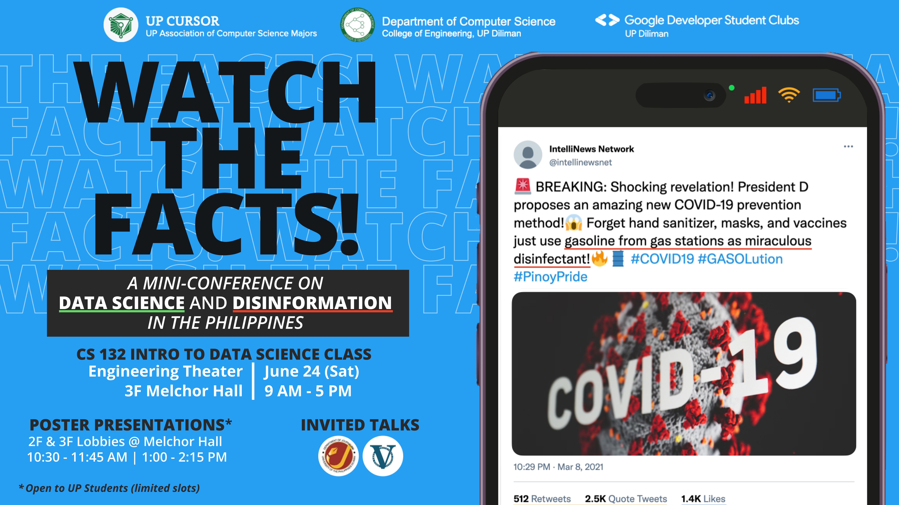
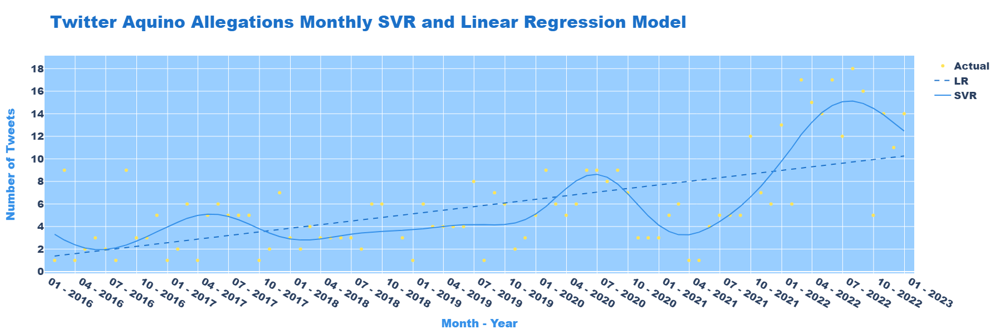
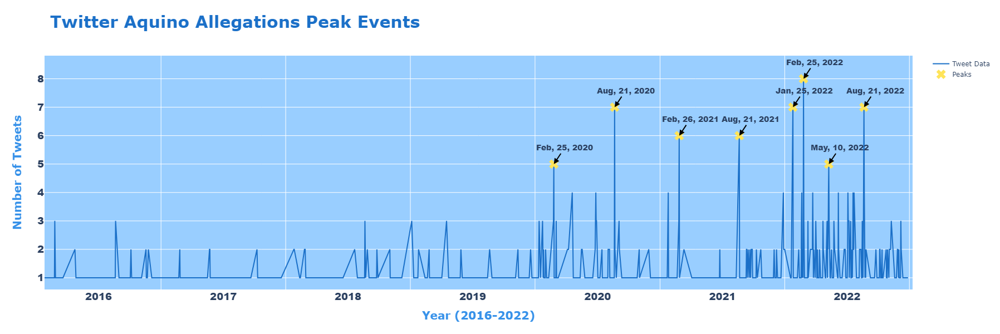

# About the Project
This project was developed as part of the requirements for our [CS 132 (Data Science)](https://dcs.upd.edu.ph/academics/undergraduate-program/) course at the University of the Philippines Diliman. Under the supervision and guidance of [Dr. Paul Rossener Regonia](https://scholar.google.com.ph/citations?user=Sh7e31UAAAAJ&hl=en), we synthesized our learnings from the event *Watch The Facts: A Mini-conference on Data Science and Disinformation in the Philippines*, held at Melchor Hall, UP Diliman on June 24, 2023.

## Awards
Our team received *two prestigious awards*, namely:

- **Technical Proficiency Award**
- **Outstanding Poster Presentation Award**

## Poster Analysis
Let's delve into the details of our poster:

## Graph Insights
Zooming into the graphical representations:

## Results
The results show how the recent events established a connection with the Aquinos, which in turn, **increased the volume of allegation tweets** against them. As the Monthly SVR and Linear Regression Model showed that the allegation tweets increased linearly in time, implying a significant increase in twitter users who contribute to the influx of mis/disinformation.

Identified peak events turned to be dates of relevant events like People Power Revolution Anniversary, Ninoy Aquino Day, Cory Aquino’s Birthday, and 2022 National Elections. Thus, these are the top contributors to the volume of allegation tweets.

This calls for a **more rigorous and extensive fact-checking**, especially during these important events that reflect our political views, not just as individuals, but our decisions as a democratic country. We should be more vigilant as the battle against mis/disinformation will never end. However, as long as journalists, data scientists, and we exist, we will do whatever it takes for truth to prevail against this sea of mis/disinformation.